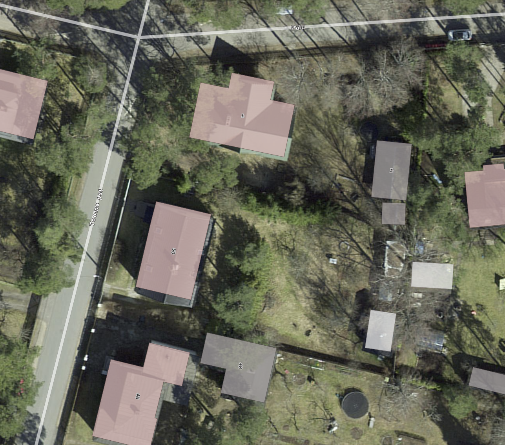

This "paper" gathers main concepts from Christopher Alexander's Nature of Order book volumes 1 and 2. Tries to find concrete definitions for them and to illustrate their interrelationships.

Modelling the concepts using a tool created by the author. The tool is inspired by NoO and written in R language. It allows to create various analysis sequences, using step-by-step transformations similar to those of Alexander, but adapted for information analysis.

Initial idea was to extract the definitions from books and perform natural language processing... but this appeared too difficult. So the definitions were gathered manually to a spreadsheet and ChatGPT was asked to help:

```{r init, message=FALSE}
library(tidyverse)
library(readxl)

# Custom code for performing the analysis
source("whoa.R")

# Source data in tabular format
concept_obs <- read_excel("data/concepts.xlsx")
glimpse(concept_obs)

# Initiate the analysis sequence
awc <- analysis("Alexandrian concepts", obs = "concept_obs")
```

Case study will be also provided, to illustrate the application of the concepts. It is about transforming author's own garden

# Person: Personal nature of order
PERSON is a person or group of people having a *list* of [goals]{.underline} in mind. They have a [self]{.underline}, i.e. a *list of personality traits*

## ChatGPT: What Christopher Alexander meant by the personal nature of order?
In his book series "The Nature of Order", Christopher Alexander introduces the idea of a "personal nature of order" which refers to the idea that the sense of wholeness and coherence in a living system is not only created by the physical and structural elements of that system, but also by the emotional and subjective experiences of the people who use it.

Alexander argues that the personal nature of order is closely linked to the human experience of beauty and meaningfulness, and that people are naturally drawn to places and spaces that have a strong sense of personal nature of order. He claims that this emotional connection is a key factor in creating a sense of "aliveness" in architecture and urban design, and that it is essential for creating livable and sustainable built environments.

He also argues that the personal nature of order is not something that can be fully designed or controlled by architects or urban planners, but rather something that emerges from the interaction between the built environment and the people who use it. He believes that the personal nature of order is created by the small-scale, everyday interactions that people have with their surroundings, such as the way they use a space, the way they decorate it, and the way they relate to the people and things around them.

In summary, Alexander's idea of personal nature of order is a holistic approach to design that considers not just the physical and structural elements of a living system but also the emotional and subjective experiences of the people who use it. He believes that this emotional connection is a key factor in creating a sense of "aliveness" and that it is essential for creating livable and sustainable built environments

## Discussion
Alexander also discusses soul, spirit, etc. things. These can be useful metaphors. However, simple list of personality traits affecting the perception might be quite sufficient

## Case study
Human stakeholders like family, neighbors, guests. But also wild and domesticated animals. Shared mental model to be created. What about our selves?

# Region: Wholeness
REGION *R* is a part of space [selected]{.underline} for consideration by PERSONs *O~i~*. Region consists of distinguishable [subregions]{.underline} *S~i~*. Region must be selected by having [wholeness]{.underline} generation in mind. Wholeness W is expressed as *product of force F and transformation effect T vectors* (defined later).

Start unfolding the concept network:

```{r fig.width=8, fig.height=6}
# Start growing the concept structure (go deep now, wide later...)
awc <- grow(awc, c("PERSON", "REGION"), depth = 2, width = 0)

# Separate domains
awc <- applyPartitioning(awc, "mbrp")
getElements(awc) %>% pull(membership) %>% unique

# Output the current state
awc
```

## ChatGPT: What he meant by region?
In his book series "The Nature of Order", Christopher Alexander defines "region" as a geographic area that has a distinct character and identity, and that is made up of a collection of smaller centers that are connected to one another. He argues that regions are an important aspect of the organization of living systems, and that they play a crucial role in creating a sense of wholeness.

Alexander claims that regions are formed by a process of "nesting", where smaller centers are grouped together to form larger centers, and that these larger centers are in turn grouped together to form still larger centers. He argues that this process of nesting creates a hierarchical structure that gives a living system its sense of coherence and harmony.

He also writes that regions have unique characteristics, which can be physical, cultural or social and can be defined by the boundaries and the centers that compose them. Alexander states that regions have an innate ability to generate life and vitality, and that they are an essential element of any livable and sustainable built environment. He also argues that regions are the product of the interaction between human culture and the natural environment, and that they are shaped by both historical and contemporary forces.

Alexander's concept of regions is closely related to his ideas about patterns and centers, and he argues that regions can be designed and built in a way that reinforces their sense of wholeness and vitality

## ChatGPT: What he meant by wholeness?
Christopher Alexander's concept of "wholeness" refers to the idea that architecture and urban design should be created as a cohesive and integrated whole, rather than as a collection of disconnected parts. He believed that buildings and cities should be designed to be in harmony with the natural and cultural context in which they are located, and that they should be responsive to the needs and desires of the people who use them.

In his book "The Timeless Way of Building", Alexander wrote that "Wholeness is the property of a thing which is so well put together that nothing can be added or taken away without impairing the function of the whole." He argued that the design of architecture and urban spaces should be based on the principles of "patterns", which are general rules that describe how different components of a building or city interact with one another.

Alexander also believed that wholeness is not only found in the physical structure but also in the way that people interact with the built environment, and he emphasized the importance of participatory design process where the users, builders, and designers all have a say in the design process.

*Q: He meant the same in Nature of Order books?*

In his book series "The Nature of Order", Christopher Alexander expanded on his earlier work on architecture and urban design, and developed a more detailed and nuanced concept of wholeness.

In these books, Alexander argues that wholeness is a fundamental quality that can be found in all living systems, including buildings, cities, and even entire societies. He claims that wholeness is characterized by a sense of coherence and harmony, and that it is created by a set of underlying "patterns of centers".

Alexander defines "centers" as the key elements of a living system that give it meaning and purpose. He argues that these centers can be found at multiple levels, from the individual components of a building to the overall structure of a city or society. He claims that the organization of these centers is what gives a living system its sense of wholeness.

He also argues that wholeness can be created or destroyed through design choices, and that the task of the designer is to create wholeness by arranging the centers in a coherent and harmonious way. He believes that this can be achieved by using a process of "generative codes" that are based on the patterns of centers that are present in the natural and cultural context of the design.

In "Nature of Order", Alexander also introduced 15 properties of living structure, which includes properties like levels of scale, strong centers, and good shape, which he considered essential for creating wholeness in architecture and urban design

## Discussion
NoO1 appendix 1 deals with this. Other parts of NoO only refer to the concept

This is all needed for managing complexity. Holism, everything connected to everything else.

No time view, region only space.

Granular finite structure of space is assumed. Need for dividing it into subregions (e.g. viewed as centers) and to take into account the affecting factors (i.e. forces)

Region must be chosen carefully, to include all the forces and making possible to capture the wholeness. NSF has diagram of selecting

Seems to be an analytical property, quality. Or structure or even same with structure?

wholeness, defined as the pattern of centers in some part of space [NoO1:98]

Wholeness an attribute of Region not Structure? (we should be more interested in former)

## Case study: Selecting the region

Selected by having a particular goal in mind, i.e. making it more inviting



# Centers: Life
CENTERs are most coherent subREGIONS of *R*. Centers may consist of other centers (have [parent]{.underline} centers). Centers can have different degrees of [life]{.underline}, expressed by a number between 0 and 1

```{r fig.width=10, fig.height=8}
awc <- grow(awc, "CENTER", depth = 2, width = 0)

# Output transformation without modifying the sequence
nodes <- getElements(awc) %>% pull(name)
applyHighlight(awc, grep("CENTER", nodes, value = TRUE))
```

## ChatGPT: What could be a good definition for center?
In the context of Christopher Alexander's work, a "center" can be defined as a key element of a living system that gives it meaning and purpose. Alexander argues that centers can be found at multiple levels, from the individual components of a building to the overall structure of a city or society. He claims that the organization of these centers is what gives a living system its sense of wholeness and coherence.

A center can also be defined as a point of focus or a point of interest within a building or a city, which creates a sense of hierarchy and organization, it could be a physical element, such as a courtyard or a stairwell, or it could be an abstract concept, such as a shared cultural or social value. Alexander also suggests that centers can be visual, such as a view, or it can be something that generates a feeling of security or a sense of belonging.

In summary, a center is a key element of a living system that gives it meaning and purpose, and that creates a sense of hierarchy, organization and coherence. It could be physical or abstract, visual or experiential, and it is a central point of focus that organizes the elements of the living system around it

*Q: Was life a metaphor to him or he took it literally?*

In his book series "The Nature of Order", Christopher Alexander uses the term "life" metaphorically to refer to the sense of vitality, coherence, and harmony that he believes is present in all living systems, including buildings, cities, and even entire societies. He argues that the built environment should be designed to create this sense of life and that it is essential for creating livable and sustainable built environments.

Alexander's use of the term "life" is rooted in his belief that the built environment is a living system, and that it should be designed in a way that is responsive to the needs and desires of the people who use it. He argues that architecture and urban design should be based on the principles of "patterns", which are general rules that describe how different components of a building or city interact with one another, and that these patterns are similar to the patterns found in natural systems.

It is important to note that Alexander's use of the term "life" is not meant to be taken literally, but rather as a metaphor for the sense of vitality, coherence, and harmony that he believes should be present in the built environment. He's not talking about living organisms or biological processes, but rather a holistic approach to design that considers the emotional and subjective experiences of the people who use it and that creates a sense of aliveness in architecture and urban design

## Discussion

Longer discussion due to centrality of this concept

### Mental model

NoO1: App 1 Building blocks of our mental models, perception

A center is a purely geometric thing, something which depends only on the arrangement, in space, of other centers.

What we call its "life" is a geometric, structural feature which is a measure of the intensity of this field.

Couldn't to find Whitehead's center definition which Alexander couldn't (NoO1 App 1 footnotes)

### Life metaphor

Life as a metaphor, qualitative attribute again.

we must also have an intuitive idea of a transformation which preserves or extends a structure, and an intuitive idea of a transformation which destroys or contradicts a structure. [NoO2:55]

## Case study
Aerial map with centers identified


# Forces
FORCE is a way CENTERs affects each other, CENTERs [balance]{.underline} FORCES. Can be o *external* (interregional) or *internal* (between centers belonging to R) [type]{.underline}. [Strength]{.underline} of force is expressed by *number between -1 and 1*. Negative number denotes a deconstructive and positive a constructive force:

```{r  echo=FALSE, fig.width=11, fig.height=10}
awc <- grow(awc, "FORCE", depth = 2, width = 0)

nodes <- getElements(awc) %>% pull(name)
applyHighlight(awc, grep("FORCE", nodes, value = TRUE))
```

## ChatGPT: What he meant by forces?
In his book series "The Nature of Order", Christopher Alexander introduces the concept of "forces" as the underlying elements that shape the built environment. He argues that the built environment is a result of the interaction between various forces, both physical and social, that act upon it.

Alexander defines physical forces as the natural forces such as topography, climate, and geology that shape the built environment. He argues that these physical forces have a direct effect on the form and structure of buildings and cities and that they should be taken into account during the design process.

He also defines social forces as the cultural, economic, and political forces that shape the built environment. He argues that these social forces have an indirect effect on the built environment and are the result of human activities. He claims that these social forces are also responsible for shaping the patterns of use and the sense of community within the built environment.

Alexander also argues that the forces are not static and that they are constantly changing and evolving over time. He believes that the built environment should be designed to respond to these changing forces, and that it should be flexible and adaptable, able to change and evolve over time.

In summary, Alexander's concept of forces refers to the underlying elements that shape the built environment, both physical and social forces that act upon it, and that these forces should be considered during the design process in order to create a livable and sustainable built environment that is responsive to the changing forces over time

## Discussion

*TODO: Maybe force is related to CENTER not REGION directly, and type belongs to CENTER. Decide after trying to model other concepts*

What makes a center "centered" is that it somehow functions as an organized field of force in space. It has a structure of centrality, it communicates centrality, it creates a spatial feeling of centrality. NoO1:117

force-field radiates outward from some system of centers. NoO1:251

Virtually always, the specific structure of centers in a given case can be explained as a result of forces and processes which are mechanical in the conventional sense. No1:290

The 253 configurations in A PATTERN LANGUAGE are of this type.9 Each pattern, when examined carefully, describes some conflict - better said, some system of conflicting forces - which will arise in the wrong sort of environment, but which can be tamed, resolved, when the environment is right. No1:380

## Case study

Depict forces in aerial view

Privacy vs openness

```{r}
# Table of forces

```

# Feeling: Beauty and depth

CENTERs [evoke]{.underline} FEELING in PERSON. FEELINGs are of various [type]{.underline} (*list*) and [intensity]{.underline} (*list*)

```{r echo=FALSE, fig.width=11, fig.height=10}
awc <- grow(awc, "FEELING", depth = 2, width = 0)

nodes <- getElements(awc) %>% pull(name)
applyHighlight(awc, grep("FEELING", nodes, value = TRUE))
```

## ChatGPT: 

## Discussion

Human feeling is mostly (90%) the same, mostly the same from person to person, mostly the same in every person [NoO1:3-4]

Types: Especially life and beauty. But also centrality/centeredness [NoO1:119], harmony [NoO1:138], similarity [NoO1:161], distinction [NoO1:203], unity [NoO1:211], structural [NoO1:220], morphological [NoO1:220], familiarity [NoO1:221], connectedness [NoO1:231], not-separateness [NoO1:234], [NoO1:309], etc.

Intensity: Can be deep, subtle, bold, eerie, etc. [NoO1]

The word "feeling" has been contaminated. It is confused with emotions - with feelings (in the plural) such as wonder, sadness, anger- which confuse rather than help because they make us ask ourselves, which kind of feeling should I follow? The feeling I am talking about is unitary. It is feeling in the singular, which comes from the whole [NoO2:371]

Buddhist interpretation, emotions to not belong to the self.

Feeling maps is a concept?

Mirror of the self related to feelings?

## Case study

Feeling maps

# Property

PROPERTIES describes one of the possible ways in which centers can [intensify]{.underline} each other [NoO1:241]. *Around 15* [types]{.underline} of such structural PROPERTIES

## Discussion

The fifteen properties are not independent. They overlap. [NoO1:237]

Each property defines one type of spatial relationship between two or more centers, and then shows how the mutual intensification works in the framework of this relationship [NoO1:241]

```{r echo=FALSE, fig.width=11, fig.height=10}
awc <- grow(awc, "PROPERTY", depth = 2, width = 0)

nodes <- getElements(awc) %>% pull(name)
applyHighlight(awc, grep("PROPERTY", nodes, value = TRUE))
```

## Case study

Void in the middle and strong borders

# Transformation

At any given moment, in any given region of space, there is a wholeness W~t~. At the next moment, this gives way to another wholeness W~t+1~. The transformation of W~t~ to W~t+1~ is the way the world unfolds: W~t~ ----\> W~t+1~. The transformation is structure-preserving (aka wholeness-extending) when the unfolding is smooth [NoO2:65]

```{r echo=FALSE, fig.width=12, fig.height=11}
awc <- grow(awc, "TRANSFORMATION", depth = 2, width = 0)

nodes <- getElements(awc) %>% pull(name)
applyHighlight(awc, grep("TRANSFORMATION", nodes, value = TRUE))
```

## ChatGPT: 

## Discussion

A center is a kind of entity which can only be defined in terms of other centers. [NoO1:116]

Generated vs fabricated structure

## Case study

First step to remove one tree for restoring the pathway

# Pattern
PATTERN [is stereotypical]{.underline} TRANSFORMATION. PATTERN [resolves conflicting]{.underline} FORCES. Frequently defined as a proven [solution]{.underline} to a [problem]{.underline} in a [context]{.underline}

```{r echo=FALSE, fig.width=13, fig.height=12}
awc <- grow(awc, "PATTERN", depth = 2, width = 0)

nodes <- getElements(awc) %>% pull(name)
applyHighlight(awc, grep("PATTERN", nodes, value = TRUE))
```

## ChatGPT: How are the patterns and transformations related?
In Christopher Alexander's work, patterns and transformations are closely related concepts.

A pattern, as he defines it, is a general rule that describes how different components of a building or city interact with one another, and that can be used to guide the design process. Alexander argues that patterns are similar to the patterns found in natural systems and that they can be used to create a sense of coherence and harmony in the built environment. He also claims that patterns are based on the principles of "centers" which are key elements of a living system that give it meaning and purpose.

Transformation, on the other hand, refers to the process of change that occurs in the built environment over time. Alexander argues that the built environment is a living system that is constantly changing and evolving, and that it should be designed to be flexible and adaptable in order to respond to these changes. He claims that the process of transformation is guided by patterns and that it is essential for creating livable and sustainable built environments.

In summary, patterns and transformations are closely related concepts in Christopher Alexander's work. Patterns are general rules that describe how different components of a building or city interact with one another, and that can be used to guide the design process. Transformations, on the other hand, refer to the process of change that occurs in the built environment over time, which is guided by patterns, and that is essential for creating livable and sustainable built environments

## Discussion

## Case study: Seaching for patterns

From APL and Nõmme traditions

# Conclusion

Level of conceptual integrity increased.

Left out: sequence, morphogenesis, pattern language, form language?

Critique of aesthetic of diagrams:

1.  Attributes should be closer to objects
